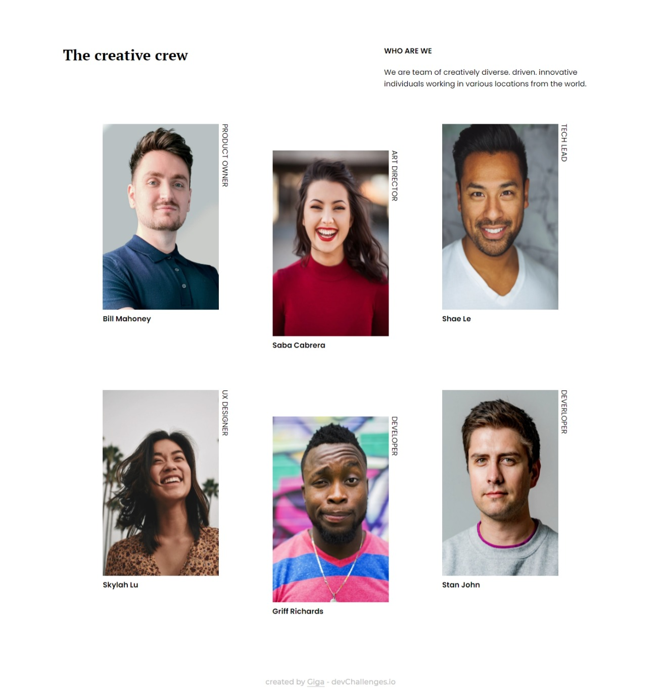

<!-- Please update value in the {}  -->

<h1 align="center">My team</h1>

   Solution for a challenge from  <a href="http://devchallenges.io" target="_blank">Devchallenges.io</a>.

  <h3>
    <a href="https://gigagiorgadze.github.io/my-team-page-master/">
      Demo
    </a>
     | 
    <a href="https://devchallenges.io/solutions/JoZA17tQVqnpa2VDFQLh">
      Solution
    </a>
     | 
    <a href="https://devchallenges.io/challenges/hhmesazsqgKXrTkYkt0U">
      Challenge
    </a>
  </h3>

<!-- TABLE OF CONTENTS -->

## Table of Contents

- [Overview](#overview)
  - [Built With](#built-with)
- [Contact](#contact)

<!-- OVERVIEW -->

## Overview
### computer screen

### mobile screen

### Built With

- HTML
- CSS

## Contact

- Website [gigagiorgadze.github.io](https://gigagiorgadze.github.io/personal-portfolio/)
- GitHub [@GigaGiorgadze](https://github.com/GigaGiorgadze)
- Twitter [@giorgadze_11](https://twitter.com/giorgaeze_11)

